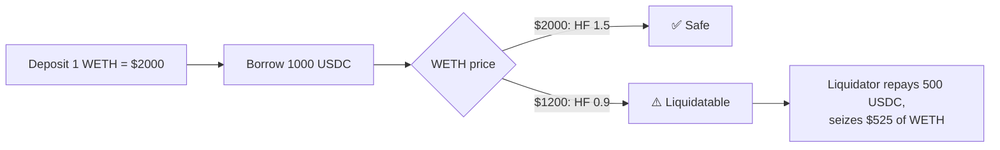

# SafeLend — over-collateralized lending with price-driven liquidations

> Deposit collateral, borrow another asset against it, and watch your **health
> factor**. Because every market is priced through an oracle, a price drop can push
> a position underwater — and anyone can liquidate it at a discount. That's the
> mechanism that keeps a real lending pool solvent.


🔗 **Live demo:** _deploy to Netlify pending_
📜 **SafeLend (Sepolia):** [0xE15E8D78d4a4576de68d483Bd5275E7C6c17D901](https://sepolia.etherscan.io/address/0xE15E8D78d4a4576de68d483Bd5275E7C6c17D901)
🪙 **WETH / USDC:** [0x0F94…80A9](https://sepolia.etherscan.io/address/0x0F94b75C2666B178DAD5443cc8d03cdc2eBC80A9) · [0x9CEe…ADC1](https://sepolia.etherscan.io/address/0x9CEef0371773F2140661f8bBA34522685733ADC1)

---

## What it does

- The owner **lists markets**, each with a **collateral factor** (max LTV) and a **price**.
- Users **deposit** collateral and **borrow** another asset against it, up to their
  borrowing power (`Σ collateral value × collateral factor`).
- A position's **health factor** is `collateral power ÷ debt`. At or above `1.00`
  it's safe; below `1.00` it can be **liquidated**.
- A **liquidator** repays part of an underwater borrower's debt and seizes their
  collateral at a **5% discount** — the incentive that gets bad debt cleared fast.

## The gap this closes

This project is based on a lending contract that summed token *amounts* directly with
no oracle — implicitly assuming every asset was worth the same, so it was only correct
for a basket of equally-priced stablecoins. Cross-asset lending (deposit ETH, borrow
USDC) is meaningless without prices.

SafeLend gives every market a **price** and compares collateral and debt by **value**:

```solidity
function collateralValue(address user) public view returns (uint256 total) {
    // Σ depositValue × collateralFactor
}
function debtValue(address user) public view returns (uint256 total) {
    // Σ borrowValue
}
function healthFactor(address user) public view returns (uint256) {
    return debt == 0 ? max : collateralValue(user) * 10_000 / debt; // BPS
}
```

Now a price move actually matters — which is the whole point of a lending protocol.

## The headline scenario (a full test)

`test_PriceDrop_MakesPositionLiquidatable_AndLiquidationWorks` walks the real story:

1. Alice deposits **1 WETH** ($2000). Borrow power = `$2000 × 75% = $1500`.
2. She borrows **1000 USDC**. Health factor = `1500 / 1000 = 1.50`. Safe.
3. **WETH crashes to $1200.** Borrow power = `$1200 × 75% = $900 < $1000` debt.
   Health factor = `0.90`. **Underwater.**
4. A liquidator repays **500 USDC** and seizes WETH worth `$500 × 1.05 = $525`
   → `0.4375 WETH`. Alice's collateral drops; the pool's bad debt shrinks.



## Tests

`forge test` — 7 tests:

| Test | What it proves |
|------|----------------|
| `test_Borrow_WithinLimit_Succeeds` | borrowing under the limit works; HF is correct |
| `test_Borrow_BeyondCollateral_Reverts` | can't borrow past your collateral power |
| `test_Withdraw_ThatBreaksHealth_Reverts` | can't withdraw collateral your debt needs |
| `test_Repay_ReducesDebtAndRestoresHealth` | repaying clears debt and restores health |
| `test_PriceDrop_MakesPositionLiquidatable_AndLiquidationWorks` | **the headline** |
| `test_Liquidate_HealthyPosition_Reverts` | a healthy position can't be liquidated |
| `test_Borrow_BeyondAvailableLiquidity_Reverts` | can't borrow more than the pool holds |

## Contracts

| File | Role |
|------|------|
| [`src/SafeLend.sol`](src/SafeLend.sol) | markets, oracle prices, deposit/withdraw/borrow/repay, health factor, liquidation |
| [`src/MockToken.sol`](src/MockToken.sol) | ERC20 test assets (WETH, USDC) with faucets |

## Run it

```bash
# contracts
git submodule update --init --recursive
forge test -vv

# frontend
cd frontend
npm ci
npm run dev   # http://localhost:3000
```

### Demo flow (on Sepolia)

1. **Faucet 100 WETH**, then **Deposit** some as collateral.
2. **Borrow USDC** up to 75% of your collateral's value.
3. Watch the **health factor** — repay or add collateral to keep it above 1.00.
4. **Repay** to free your collateral, then **Withdraw**.

## Design notes (kept honest)

- **Prices are owner-set**, standing in for a Chainlink feed — a production deploy
  would read a real oracle, never a privileged setter.
- **Interest accrual is out of scope.** This models the collateral / health /
  liquidation core, not a full interest-bearing money market.

## Stack

- **Contracts:** Solidity 0.8.24, Foundry, OpenZeppelin (SafeERC20, ReentrancyGuard, Ownable)
- **Frontend:** Next.js 15, wagmi v2, viem, RainbowKit, Tailwind v4
- **Network:** Sepolia testnet

## What I learned

- A lending protocol *is* its oracle: without prices, "collateral" and "debt" across
  different assets are incomparable, and liquidation — the thing that keeps the pool
  solvent — can't exist.
- The health factor is just `collateral power ÷ debt`; every guard (borrow, withdraw,
  liquidate) is one comparison against it, evaluated *after* applying the intended change.
- The liquidation bonus isn't a fee grab — it's the incentive that makes third parties
  race to clear bad debt the moment a position goes underwater.

---

**Armando Ochoa** · Smart Contract Developer
Part of a 17-block blockchain accelerator — this is the lending & borrowing module (Block 17), the final block.
